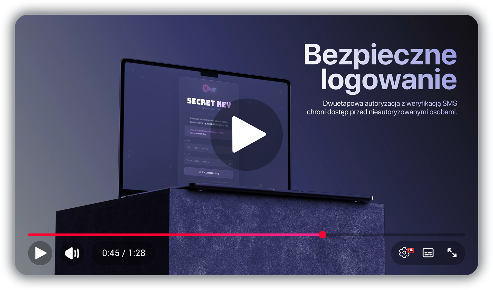

<div align="center">


</div>

---

<p align="center">
  <a href="../README.md">🇵🇱 Polski</a> •
  <a href="README_EN.md">🇬🇧 English</a> •
  <a href="README_ES.md">🇪🇸 Español</a> •
  <a href="README_DE.md">🇩🇪 Deutsch</a> •
  <a href="README_PT_BR.md">🇧🇷 Português (Brasil)</a> •
  <a href="README_FR.md">🇫🇷 Français</a> •
  <a href="README_ZH.md">🇨🇳 简体中文</a> •
  <a href="README_AR.md">🇸🇦 العربية</a> •
  <a href="README_HI.md">🇮🇳 हिन्दी</a> •
  <a href="README_JA.md">🇯🇵 日本語</a> •
  <a href="README_RU.md">🇷🇺 Русский</a> •
  <kbd>🇺🇦 Українська</kbd>
</p>

---

<div align="center">

### Криптографічна система аварійного доступу до вашої бази паролів

<br>

[](https://php.net)
[](#stack)
[](#встановлення)
[](#безпека)
[](#алгоритм-шаміра)
[](../LICENSE)

<br>

**Що станеться з вашими облікові записи після вашої смерті?**

Secret Key криптографічно розділяє головний пароль вашої бази паролів між довіреними людьми.  
Ніхто не знає його самостійно — лише разом, у домовлений момент, вони можуть його відновити.

<br>


<br>

[**→ Дивитися демо**](https://app.secretkey.website) &nbsp;·&nbsp; [**Сайт проєкту**](https://secretkey.website) &nbsp;·&nbsp; [**Документація**](https://secretkey.website/docs)

</div>

---

## Зміст

- 01 · 🔑 [Ідея](#ідея)
- 02 · ⚙️ [Як це працює](#як-це-працює)
- 03 · 🎬 [Огляд системи](#огляд-системи)
- 04 · 💳 [Картка Secret Key](#картка-secret-key)
- 05 · 🔐 [Алгоритм Шаміра](#алгоритм-шаміра)
- 06 · 🏗️ [Архітектура системи](#архітектура-системи)
- 07 · 🛡️ [Безпека](#безпека)
- 08 · 🚀 [Встановлення](#встановлення)
- 09 · 📁 [Структура файлів](#структура-файлів)
- 10 · ❓ [Часті запитання](#faq)

---

## Ідея

Кожен з нас зберігає десятки паролів — від банків, електронної пошти, соціальних мереж, підписок. **Що з ними станеться після нашої смерті?** Родина втрачає доступ до облікових записів, не може скасувати підписки, закрити рахунки, повернути кошти.

Secret Key вирішує цю проблему, створюючи безпечний аварійний план із двома гарантіями:

| &nbsp; | Проблема | Рішення |
|---|---|---|
| 🔐 | Неавторизований доступ **за життя** власника | Кожна спроба доступу вимагає пароль + SMS-код |
| 💀 | Втрата доступу до облікових записів **після смерті** | Призначені люди відновлюють пароль за допомогою алгоритму Шаміра |

Система **повністю самостійно розміщена (self-hosted)** — дані ніколи не залишають ваш сервер. Жодної центральної бази даних, жодної хмари, жодних зовнішніх залежностей окрім надсилання SMS.

<a name="stack"></a>

```
Backend         PHP 8+, файли без БД (JSON + PHP-конфіг), нуль SQL
Авторизація     bcrypt cost=10, 2FA через SMS через API SMSPlanet
Криптографія    Shamir Secret Sharing (secrets.js)
Frontend        Чистий HTML + JS, нуль зовнішніх залежностей (офлайн)
```

---

## Як це працює

У кризовій ситуації призначені люди виконують чотири кроки:

```
┌──────────────────────────────────────────────────────────────────────┐
│                                                                      │
│  01  ЗБІР             Мінімум 3 з 5 призначених людей                │
│      ─────────       У кожного картка з фрагментом ключа             │
│                                                                      │
│  02  ВХІД             Облікові дані з картки Secret Key              │
│      ──────────      + SMS-код на прив'язаний номер телефону         │
│                                                                      │
│  03  ФРАГМЕНТИ        Кожен вводить свій фрагмент або                 │
│      ─────────       скановує QR-код з картки                        │
│                                                                      │
│  04  ДОСТУП           Пароль відновлюється локально в браузері —      │
│      ────────        і ніколи не потрапляє на сервер                  │
│                                                                      │
└──────────────────────────────────────────────────────────────────────┘
```

**Без телефону, прив'язаного до облікового запису, увійти неможливо** — навіть знаючи дані з картки.  
**Без потрібної кількості фрагментів відновити пароль математично неможливо** — навіть маючи доступ до сервера.

---

## Огляд системи

<p align="center">
  <a href="https://www.youtube.com/watch?v=omx7mpQD5-M" target="_blank">
    
  </a>
</p>

> [!TIP]
> 🔊 Відео доступне кількома мовами — натисніть ⚙️ у плеєрі YouTube → **Субтитри/Аудіо (Audio track)**, щоб вибрати мову озвучення або увімкнути субтитри.

---

## Картка Secret Key

Кожна призначена людина отримує персоналізований носій із чотирма елементами:

| Елемент | Опис |
|---|---|
| 🔑 **Логін і пароль** | Унікальні облікові дані — у кожного власний облік із прив'язаним номером телефону |
| 🔢 **Фрагмент Шаміра** | Фрагмент ключа у hex-форматі — один із п'яти, непотрібний без решти |
| ⊞ **QR-код** | Той самий фрагмент, закодований у QR — сканування унеможливлює помилки ручного переписування |
| 🌐 **Адреса системи** | URL вашого власного екземпляра Secret Key — веде прямо на панель входу |

**Формат носія може бути будь-яким** — надрукований лист, PDF, пластикова картка. Головне, щоб він містив перелічені вище чотири елементи.

---

## Алгоритм Шаміра

Secret Key використовує бібліотеку [`secrets.js`](https://github.com/amper5and/secrets.js) для розділення та відновлення секрету.

> [!NOTE]
> Використана бібліотека **ідентична тій, що використовується на [iancoleman.io/shamir](https://iancoleman.io/shamir/)** — формат фрагментів повністю сумісний, що дозволяє незалежну перевірку поза системою.

### Розділення та відновлення секрету

```
Головний пароль: "MyKeePassPassword2024!"
         │
         ▼  Розділення на 5 фрагментів (порог: 3)
         │
    ┌────┴──────────────────────────────────┐
    │                                       │
    │  S1: 801a3f9c2e4b7d1...  →  Особа A   │  Кожен фрагмент
    │  S2: 802c8f1a5e9b3d7...  →  Особа B   │  непотрібний без
    │  S3: 803e2a7f4c1b9d5...  →  Особа C   │  потрібної
    │  S4: 804b6d3e8f2a1c9...  →  Особа D   │  кількості
    │  S5: 805d9f7b2e4c3a1...  →  Особа E   │  решти
    │                                       │
    └────┬──────────────────────────────────┘
         │
         ▼  Відновлення — достатньо будь-яких 3 з 5
         │
    S1 + S2 + S3  →  "MyKeePassPassword2024!"  ✓
    S2 + S4 + S5  →  "MyKeePassPassword2024!"  ✓
    S1            →  жодної інформації про секрет  ✗
```

### Криптографічні властивості

Секрет кодується як вільний член многочлена над полем GF(2⁸). Кожен фрагмент — це точка на цьому многочлені; знаючи потрібну кількість точок, його можна однозначно відновити через інтерполяцію Лагранжа:

```
f(x) = a₀ + a₁x + a₂x² + ... + aₖ₋₁xᵏ⁻¹  (mod p)
```

> [!IMPORTANT]
> Володіння **меншою, ніж потрібно,** кількістю фрагментів не дає **жодної** інформації про секрет (information-theoretic security). Додатковий падинг у 1024 біти запобігає атакам на малі секрети.

### Параметри реалізації

| Параметр | Значення |
|---|---|
| Бібліотека | secrets.js (amper5and) — сумісна з iancoleman.io |
| Формат фрагмента | `8` + 2-hex x-координата + дані |
| minPad | 1024 біти |
| Кодування | UTF-8 (str2hex) |
| Відновлення | JavaScript на боці браузера — пароль ніколи не потрапляє на сервер |

### Вибір параметрів розділення

| Загальна кількість фрагментів | Потрібний мінімум | Сценарій |
|---|---|---|
| 3 | 2 | Невелика родина |
| 5 | 3 | Стандарт *(рекомендовано)* |
| 7 | 4 | Більша родина / компанія |

---

## Архітектура системи

Користувач послідовно проходить кілька рівнів перевірки, перш ніж отримати доступ до захищених ресурсів:

```
Користувач   →  вводить логін + пароль
                         │
Система PHP  →  перевіряє пароль (bcrypt), перевіряє rate limiting та CSRF
                         │
SMS / 2FA    →  надсилає одноразовий код на прив'язаний номер
                         │
Користувач   →  вводить SMS-код
                         │
Система PHP  →  перевіряє код, створює сесію, опційно запам'ятовує пристрій
                         │
Браузер      →  приймає фрагменти Шаміра, відновлює секрет локально на JS
```

### Рівні системи

**Рівень авторизації** (`/app/`)
- `login.php` — форма входу
- `auth.php` — логіка сесії, bcrypt, 2FA, захист від брутфорсу, CSRF, а також допоміжні функції `t()` (тексти інтерфейсу), `md_lite()` (спрощений markdown), `empty_state_box()`
- `verify.php` — перевірка SMS-коду
- `resend.php` — повторне надсилання SMS
- `logout.php` — вихід із системи

**Рівень доступу** (`/decrypt/`)
- `index.php` — панель розшифрування з відновленням за Шаміром на JS
- `download.php` — контрольована видача файлів (потребує сесію, білий список, побудований із конфігурації, логування на боці сервера)
- `log.php` — логування подій
- `devtools-log.php` — логування спроб відкриття DevTools (з обмеженням частоти за IP)

**Рівень даних** (`/private/` — за межами `public_html`)
- `secret-key.php` — єдиний файл конфігурації: люди (`$people`), файли для завантаження (`$downloads`), інструкція (`$instructions`), email-сповіщення (`$email_notify`), домен для SMS
- `lang.php` — тексти інтерфейсу (лише одна мова, без перемикача — див. [Встановлення](#встановлення))
- `rate-limit.php` — постійне обмеження частоти (лічильники незалежні від сесії)
- `rate_limits.json` — лічильники спроб входу за IP/обліковим записом *(створюється автоматично)*
- `trusted_devices.json` — токени довірених пристроїв *(створюється автоматично)*
- `secret-key.log` — журнали подій
- `moja-baza-hasel.kdbx` *(та інші файли для завантаження)* — віддаються лише через `download.php`, ніколи безпосередньо через HTTP

> [!WARNING]
> Усі чутливі конфігураційні файли зберігаються **за межами публічної директорії** сервера — неправильне налаштування веб-сервера не створює ризику їх розкриття.

---

## Безпека

Система поєднує **вісім незалежних рівнів захисту** — компрометація одного з них не дає доступу до системи.

| Рівень | Механізм | Деталі |
|---|---|---|
| 🔒 **Паролі** | bcrypt | cost=10, формат `$2y$`, перевірка, стійка до атак за часом |
| 🛡️ **CSRF** | Токен із 64 hex-символів | Генерується криптографічно, перевіряється на кожній кінцевій точці, що змінює стан (вхід, перевірка 2FA, повторне надсилання SMS, журнал подій) |
| 🚫 **Брутфорс** | Rate limiting | 3 спроби/IP + 3 спроби/облік за 15 хвилин; 3 неправильні SMS-коди/год. Постійні лічильники на боці сервера (файл, незалежний від сесії/кук клієнта) |
| 📱 **2FA через SMS** | 6-значний код | Генерується криптографічно, діє 10 хвилин, затримка 60 секунд між надсиланнями |
| 💻 **Довірені пристрої** | SHA-256, HttpOnly | Secure + SameSite=Strict, файл за межами `public_html`, TTL 7 днів |
| ⏱️ **Сесія** | Автовихід | Cookie сесії з явними прапорцями HttpOnly + Secure + SameSite=Strict; тайм-аут 30 хвилин, регенерація ID сесії після кожної перевірки |
| 🖥️ **Захист інтерфейсу** | Виявлення DevTools | Виявляє інструменти розробника, фізично видаляє DOM, логує інцидент з IP, REF# та тривалістю |
| 📥 **Контрольовані завантаження** | `download.php` + білий список | Файли для завантаження знаходяться за межами `public_html`; потрібна активна сесія, жодного прямого URL, завжди логується на боці сервера |

---

## Встановлення

### Вимоги

- PHP 8.0+
- Веб-сервер (Apache / Nginx)
- Облік у [SMSPlanet](https://smsplanet.pl) (для надсилання кодів 2FA)
- Доступ до директорії за межами `public_html`

---

### Крок 1 — Конфігурація (офлайн)

Відкрийте `dashboard.html` локально у браузері. Він містить дві вкладки:

**Конфігурація** — генерує файл `secret-key.php`:
1. Токен API SMSPlanet, ім'я відправника SMS та домен для автозаповнення коду (Android/iOS) — лише домен, без `@` і без `https://`
2. Для кожної призначеної особи: логін, пароль, ім'я, прізвище, номер телефону та чи має вона бути видимою у списку власників на панелі
3. Файли для завантаження (база паролів, база 2FA, інсталятор програми) — ключ, підпис кнопки, ім'я файлу
4. Кроки інструкції для панелі (форматування: `**напівжирний**` / `*курсив*`)
5. Опційно: email-сповіщення при кожному вході (адреса отримувача, відправник, посилання на панель)
6. Натисніть «Згенерувати конфігурацію» та завантажте отриманий файл `secret-key.php`

**Шифрування** — розділяє головний пароль на фрагменти Шаміра:
1. Введіть головний пароль бази паролів
2. Задайте загальну кількість фрагментів та потрібний мінімум
3. Натисніть «Згенерувати фрагменти»
4. Завантажте файл `secret-key-shares.txt`

> [!TIP]
> Обидва інструменти працюють **повністю офлайн** — жодні дані не залишають браузер. Форма генерує `secret-key.php` з нуля під час кожного запуску — вона не завантажує і не редагує наявний файл.

---

### Крок 2 — Завантаження на сервер

```bash
/home/user/
├── public_html/
│   ├── app/           ← вміст папки /app/
│   └── decrypt/       ← вміст папки /decrypt/
└── private/           ← ЗА МЕЖАМИ public_html
    ├── secret-key.php  ← згенерований файл конфігурації
    ├── lang.php        ← тексти інтерфейсу (одна мова, див. крок 1)
    ├── rate-limit.php  ← системний файл із репозиторію (rate limiting)
    └── moja-baza-hasel.kdbx  ← ваші файли (віддаються через download.php)
```

> [!WARNING]
> `lang.php` має бути завантажений на сервер **разом із** `secret-key.php`. `auth.php` завантажує його через `require_once` — відсутність файлу обвалює всю систему (фатальна помилка на кожній сторінці), а не лише переклади.

---

### Крок 3 — Шлях до конфігурації

У файлі `auth.php` оновіть шлях до файлу конфігурації:

```php
require_once '/home/user/private/secret-key.php';
```

---

### Крок 4 — Домен у вмісті SMS (WebOTP)

Вміст надісланого SMS-коду закінчується рядком `@домен #код` — це формат, необхідний [WebOTP API](https://developer.mozilla.org/en-US/docs/Web/API/WebOTP_API), завдяки якому браузер телефону сам заповнює поле коду, без ручного переписування з SMS.

Домен задається на **кроці 1**, у формі дашборду (поле «Домен для автозаповнення SMS») — вводите лише сам домен, без `@` і без `https://` (дашборд додає `@` автоматично). У конфігурації він виглядає так:

```php
define('SMS_AUTOFILL_DOMAIN', '@ваш-домен.ua');
```

> [!WARNING]
> Домен повинен **точно** збігатися з тим, під яким ви розміщуєте систему — інакше WebOTP ігноруватиме SMS і автозаповнення не працюватиме. Код все одно прийде і працюватиме при ручному введенні, просто без цієї зручності.

---

### Крок 5 — Розповсюдження карток

Для кожної призначеної особи підготуйте носій із:
- логіном та паролем (з вкладки «Конфігурація»)
- фрагментом Шаміра (з файлу `secret-key-shares.txt`)
- опційно: QR-кодом із тим самим фрагментом
- адресою вашого екземпляра системи

---

## Структура файлів

```
secret-key/
│
├── 📁 app/                        # Публічна — система входу
│   ├── 📁 decrypt/                # Захищена — панель користувача
│   │   ├── .htaccess
│   │   ├── card-secret-key.webp
│   │   ├── devtools-log.php
│   │   ├── download.php
│   │   ├── favicon.ico
│   │   ├── index.php
│   │   ├── key.svg
│   │   └── log.php
│   ├── .htaccess
│   ├── auth.php
│   ├── favicon.ico
│   ├── key.svg
│   ├── login.php
│   ├── logout.php
│   ├── resend.php
│   └── verify.php
│
├── 📁 dashboard/                  # Інструменти конфігурації (офлайн)
│   ├── card-back.js
│   ├── card-front.js
│   ├── dashboard.html
│   ├── favicon.ico
│   ├── generate-card.html
│   ├── generate-hash.html
│   └── generate-shamir.html
│
├── 📁 img/                        # Графічні ресурси
│
└── 📁 private/                    # За межами public_html — файли конфігурації
    ├── .htaccess
    ├── demo-baza-hasel.txt         # Приклад файлу для завантаження (замініть на свій)
    ├── lang.php                    # Тексти інтерфейсу (одна мова)
    ├── rate-limit.php
    └── secret-key.php
```

---

## Часті запитання

<details>
<summary><strong>Що станеться, якщо я загублю картку Secret Key?</strong></summary>

Сама картка непотрібна без доступу до телефону, прив'язаного до цього облікового запису — вхід потребує SMS-підтвердження. Ризик обмежений, однак власника слід повідомити і розглянути можливість генерації нової конфігурації з новим набором фрагментів.

</details>

<details>
<summary><strong>Чи можу я самостійно прочитати пароль, маючи лише одну картку?</strong></summary>

Ні. Це математично неможливо. Один фрагмент не розкриває жодної інформації про секрет — це властивість алгоритму, яка називається information-theoretic security. Відновити головний пароль дозволяє лише зібрання потрібної кількості фрагментів.

</details>

<details>
<summary><strong>Що якщо одна з призначених осіб помре або стане недоступною?</strong></summary>

Система спроєктована з надлишковістю — достатньо зібрати мінімально потрібну кількість фрагментів (наприклад, 3 з 5). Недоступність однієї-двох осіб не блокує аварійну процедуру, якщо решта можуть зібратися.

</details>

<details>
<summary><strong>Чи потрапляє пароль на сервер під час розшифрування?</strong></summary>

Ні. Відновлення пароля з фрагментів Шаміра відбувається **повністю на боці браузера** (JavaScript). Сервер використовується лише для автентифікації користувача — сам секрет ніколи його не залишає.

</details>

<details>
<summary><strong>Чи можу я використовувати систему з іншим менеджером паролів, не KeePassXC?</strong></summary>

Так. Secret Key зберігає та відновлює **будь-який головний пароль** — незалежно від використовуваного менеджера. Сумісний із будь-якою програмою, що підтримує головний пароль: KeePassXC, Bitwarden, 1Password та іншими.

</details>

<details>
<summary><strong>Як вибрати порог — скільки фрагментів потрібно?</strong></summary>

Чим вищий порог, тим вища безпека — але й тим важче зібрати всіх у кризовій ситуації. Рекомендований компроміс для стандартного використання — **3 з 5**: допускає недоступність двох осіб, зберігаючи хороший рівень захисту.

</details>

<details>
<summary><strong>Як довго дійсні облікові дані з картки?</strong></summary>

Безстроково — доки власник не згенерує нову конфігурацію і не замінить файл `secret-key.php` на сервері. Після цієї операції старі картки перестають працювати, і потрібно розповсюдити нові серед усіх призначених людей.

</details>

---

<div align="center">

Copyright © 2026 · [karpierz.me](https://karpierz.me)

</div>
